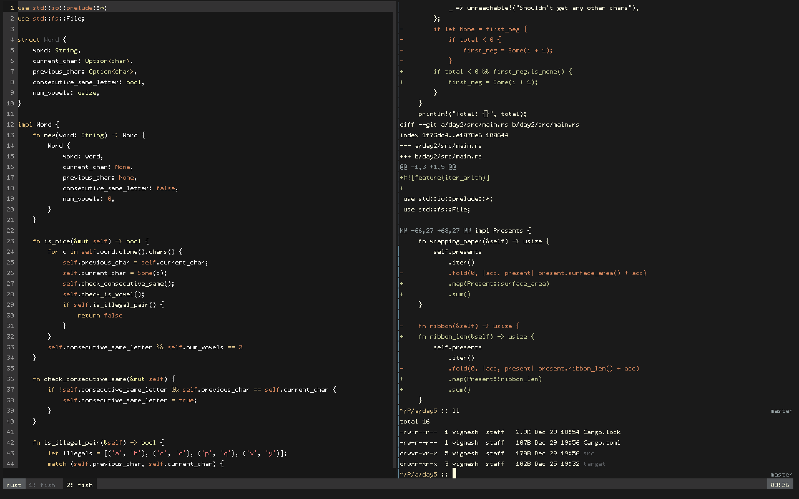

# dotfiles

these are my dotfiles. i leave them here so they're safe and for reference. this contains my iterm/vim/tmux/fish setup.

- vim plugin manager is plug
- theme is twilight

some other tools I like to use on my setups:
- httpie
- ag
- homebrew
- virtualenv / virtualfish
- ipython
- archey
- tree
- jq
- spark
- hub

